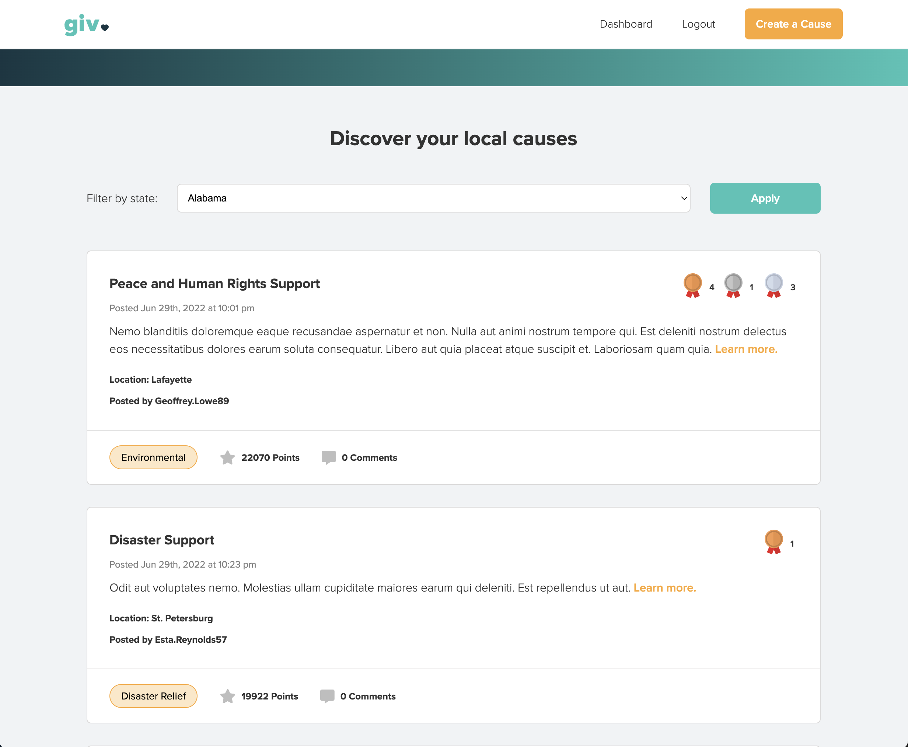

# this is giv.
[](https://opensource.org/licenses/MIT)

## Table of contents
* [User Story](#user-story)
* [Description](#description)
* [Technologies](#technologies)
* [Directions for Future Development](#directions-for-future-development)
* [Installation](#installation)
* [Usage](#usage)
* [Credits](#credits)
* [Results](#results)
* [Preview](#preview)
* [Contributers](#contributers)
* [License](#license)

## User Story
AS A member of a cause or charity

I WANT an social media platform where I can post my cause to the public

SO THAT I can promote it and gain donations

...

AS A charitable person

I WANT a social media platform where I can communicate and learn about different causes

SO THAT I can determine whether or not I’d like to donate

## Description
giv. is a social media application where users can post their Cause to promote and gain publicity as well as drive traffic to their charity's website. Fellow users ohave the ability to purchase points, distribute them to Causes as donations, and post comments.

Causes with more points also appear towards the top of the homepage feed, allowing users to have influence on the reputation of the Cause and help willing donors to determine if a charity is reputable enough to giv.

## Technologies
This project was created using:
* HTML/CSS
* JavaScript
* Node.js
* Express
* Faker
* bcrypt
* Mongoose
* React
* GraphQL
* Apollo
* Heroku
* JSON Web Tokens

## Installation
To clone this repository, open the terminal and type the following to install all the packages:
```
npm install
```

After cloning, run the application by typing the following into the command line:

```
npm run develop
``` 

## Usage
Use the Heroku link below to use giv.

## Credits
* Adobe Fonts/Typekit: https://fonts.adobe.com/
* Font Awesome: https://fontawesome.com/icons
* npm: https://www.npmjs.com/

## Results
* [Heroku URL](https://giv-social.herokuapp.com/)
* [GitHub Repository](https://github.com/Jesse-Lemieux/giv)

## Preview



## Directions for Future Development
* Geolocation to find/categorize feed by local charities and causes
* Ability to upload images for a cause page or profile image
* Direct message/collaboration capabilities
* Search or filter functionality
* Payment implementation to purchase points


## Contributers
* [Jesse Lemieux](https://github.com/Jesse-Lemieux)
* [Nick Melanson](https://github.com/norklas)
* [Matt Noreika](https://github.com/noreikam)
* [Erica Trenholm](https://github.com/etrenholm)

## License
This project is covered by the [MIT License](https://opensource.org/licenses/MIT)

### ©️ June 2022
